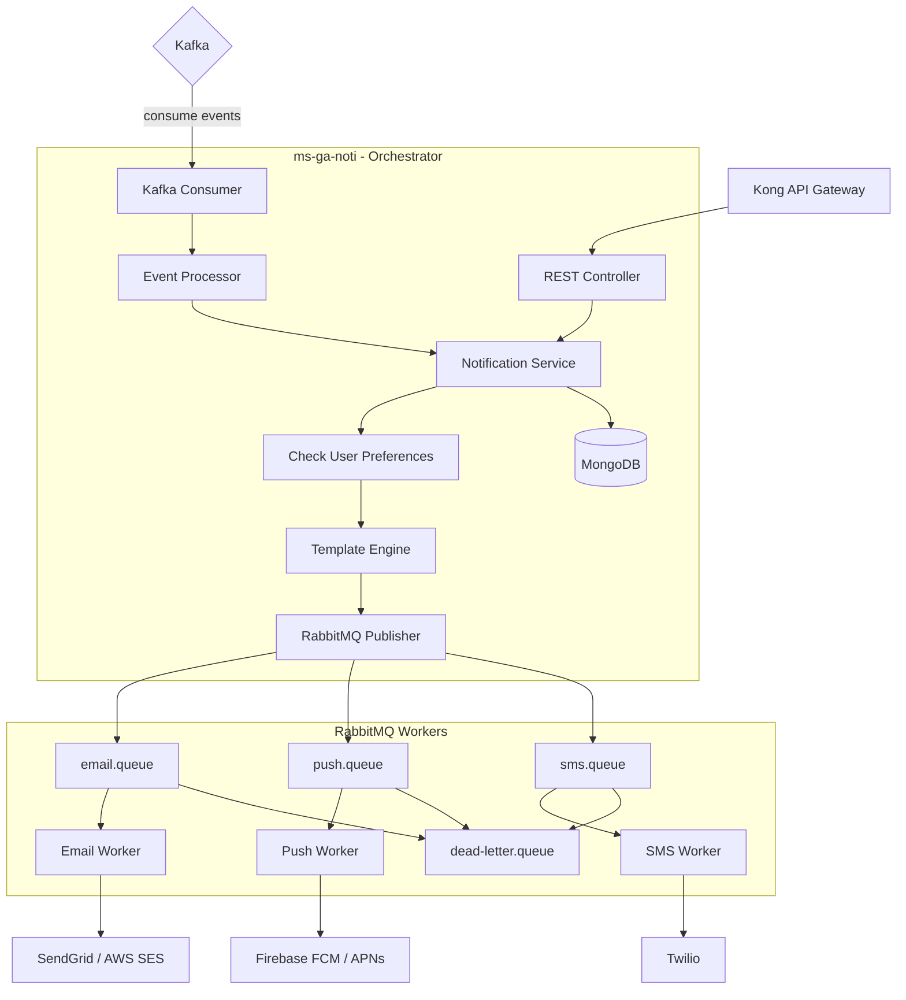

# ms-ga-noti — Notification Service

## Overview

| Property           | Value                                                  |
| ------------------ | ------------------------------------------------------ |
| **Language**       | Node.js (TypeScript)                                   |
| **Framework**      | Express                                                |
| **Database**       | MongoDB (Mongoose)                                     |
| **Message Broker** | RabbitMQ (delivery queues) + Kafka (event consumption) |
| **Port**           | 8091                                                   |
| **Base Path**      | `/gymapi/v1/notifications`                             |
| **Architecture**   | Clean Architecture + Event-Driven                      |

**Purpose:** The notification orchestration hub. Consumes domain events from Kafka, decides what notifications to send based on templates and user preferences, and dispatches them to RabbitMQ delivery queues. Separate worker processes consume from RabbitMQ and deliver via email (SendGrid/SES), push notifications (FCM/APNs), and SMS (Twilio).

---

## Architecture Diagram



---

## Project Structure

```
ms-ga-noti/
├── src/
│   ├── server.ts
│   ├── app.ts
│   ├── config/
│   │   └── index.ts
│   ├── api/
│   │   ├── controllers/
│   │   │   ├── notification.controller.ts
│   │   │   ├── template.controller.ts
│   │   │   └── preference.controller.ts
│   │   ├── middlewares/
│   │   │   ├── auth.middleware.ts
│   │   │   ├── permission.middleware.ts
│   │   │   └── correlation.middleware.ts
│   │   └── routes/
│   │       ├── notification.routes.ts
│   │       ├── template.routes.ts
│   │       └── preference.routes.ts
│   ├── application/
│   │   ├── services/
│   │   │   ├── notification.service.ts
│   │   │   ├── template.service.ts
│   │   │   └── preference.service.ts
│   │   └── event-handlers/
│   │       ├── identity.event.handler.ts      # identity.registered → welcome email
│   │       ├── membership.event.handler.ts    # subscription.expiring_soon → reminder
│   │       ├── booking.event.handler.ts       # booking.created → confirmation
│   │       ├── payment.event.handler.ts       # payment.completed → receipt
│   │       ├── customer.event.handler.ts      # customer.goal.achieved → congrats
│   │       └── trainer.event.handler.ts       # trainer.certification.expiring → alert
│   ├── domain/
│   │   ├── entities/
│   │   │   ├── notification.entity.ts
│   │   │   ├── template.entity.ts
│   │   │   └── preference.entity.ts
│   │   └── repositories/
│   │       ├── notification.repository.interface.ts
│   │       └── template.repository.interface.ts
│   ├── infrastructure/
│   │   ├── database/
│   │   │   ├── connection.ts
│   │   │   └── schemas/
│   │   │       ├── notification.schema.ts
│   │   │       ├── template.schema.ts
│   │   │       └── preference.schema.ts
│   │   ├── repositories/
│   │   │   ├── notification.repository.ts
│   │   │   └── template.repository.ts
│   │   └── messaging/
│   │       ├── kafka.consumer.ts
│   │       └── rabbitmq.publisher.ts
│   ├── workers/
│   │   ├── email.worker.ts             # Consumes email.queue
│   │   ├── push.worker.ts              # Consumes push.queue
│   │   └── sms.worker.ts               # Consumes sms.queue
│   └── shared/
│       ├── errors/
│       ├── logger/
│       └── utils/
│           └── template.engine.ts      # Handlebars/Mustache template rendering
├── tests/
├── docker-compose.yml
├── Dockerfile
├── package.json
├── tsconfig.json
└── README.md
```

---

## Domain Entities

### `NotificationTemplate`

```typescript
interface NotificationTemplate {
  _id: string;
  name: string; // e.g. "booking_confirmation"
  channel: NotificationChannel; // email | push | sms
  subject: string; // For email
  bodyTemplate: string; // Handlebars template
  variables: string[]; // Required variables: ["customer_name", "class_name"]
  isActive: boolean;
  createdAt: Date;
  updatedAt: Date;
}

type NotificationChannel = "email" | "push" | "sms";
```

### `Notification`

```typescript
interface Notification {
  _id: string;
  customerId: string;
  templateId: string;
  channel: NotificationChannel;
  status: NotificationStatus;
  subject: string;
  body: string; // Rendered body
  metadata: Record<string, unknown>;
  sentAt: Date | null;
  deliveredAt: Date | null;
  readAt: Date | null;
  failureReason: string | null;
  retryCount: number;
  createdAt: Date;
}

type NotificationStatus = "pending" | "sent" | "delivered" | "failed" | "read";
```

### `NotificationPreference`

```typescript
interface NotificationPreference {
  _id: string;
  customerId: string;
  emailEnabled: boolean;
  pushEnabled: boolean;
  smsEnabled: boolean;
  quietHoursStart: string | null; // "22:00"
  quietHoursEnd: string | null; // "08:00"
  unsubscribedTopics: string[]; // e.g. ["marketing", "promotions"]
  updatedAt: Date;
}
```

---

## MongoDB Schemas

### Notification Schema

```typescript
const NotificationSchema = new Schema(
  {
    customerId: { type: String, required: true, index: true },
    templateId: { type: Schema.Types.ObjectId, ref: "NotificationTemplate" },
    channel: { type: String, enum: ["email", "push", "sms"], required: true },
    status: {
      type: String,
      enum: ["pending", "sent", "delivered", "failed", "read"],
      default: "pending",
      index: true,
    },
    subject: { type: String },
    body: { type: String, required: true },
    metadata: { type: Schema.Types.Mixed },
    sentAt: { type: Date },
    deliveredAt: { type: Date },
    readAt: { type: Date },
    failureReason: { type: String },
    retryCount: { type: Number, default: 0 },
  },
  { timestamps: true },
);

NotificationSchema.index({ customerId: 1, createdAt: -1 });
NotificationSchema.index({ status: 1, createdAt: -1 });
```

---

## Kafka Event Handlers

### Event → Notification Mapping

| Kafka Event                      | Template                       | Channel      | Recipient |
| -------------------------------- | ------------------------------ | ------------ | --------- |
| `identity.registered`            | `welcome_email`                | email        | New user  |
| `identity.registered`            | `verify_email`                 | email        | New user  |
| `booking.created`                | `booking_confirmation`         | email + push | Customer  |
| `booking.waitlist.promoted`      | `waitlist_promoted`            | email + push | Customer  |
| `booking.cancelled`              | `booking_cancelled`            | email        | Customer  |
| `subscription.expiring_soon`     | `subscription_expiry_reminder` | email + push | Customer  |
| `subscription.expired`           | `subscription_expired`         | email        | Customer  |
| `payment.completed`              | `payment_receipt`              | email        | Customer  |
| `payment.failed`                 | `payment_failed`               | email + push | Customer  |
| `invoice.overdue`                | `invoice_overdue`              | email + sms  | Customer  |
| `customer.goal.achieved`         | `goal_achieved`                | push         | Customer  |
| `trainer.certification.expiring` | `cert_expiry_reminder`         | email        | Trainer   |
| `order.status.changed`           | `order_status_update`          | email + push | Customer  |

### Event Handler Pattern

```typescript
// application/event-handlers/booking.event.handler.ts
export class BookingEventHandler {
  constructor(
    private readonly notificationService: NotificationService,
    private readonly preferenceService: PreferenceService,
  ) {}

  async handle(event: KafkaEvent): Promise<void> {
    if (event.eventType === "booking.created") {
      const { customerId, className, startTime } = event.data;

      // Check user preferences
      const prefs = await this.preferenceService.getPreferences(customerId);

      // Send email confirmation
      if (prefs.emailEnabled) {
        await this.notificationService.send({
          customerId,
          templateName: "booking_confirmation",
          channel: "email",
          variables: {
            class_name: className,
            start_time: startTime,
          },
        });
      }

      // Send push notification
      if (prefs.pushEnabled) {
        await this.notificationService.send({
          customerId,
          templateName: "booking_confirmation_push",
          channel: "push",
          variables: {
            class_name: className,
            start_time: startTime,
          },
        });
      }
    }
  }
}
```

---

## RabbitMQ Queue Structure

### Queue Configuration

```typescript
const QUEUES = {
  EMAIL: "noti.email",
  PUSH: "noti.push",
  SMS: "noti.sms",
  DEAD_LETTER: "noti.dead-letter",
};

const EXCHANGES = {
  NOTIFICATIONS: "notifications",
  DEAD_LETTER: "notifications.dlx",
};
```

### Message Format

```typescript
interface QueueMessage {
  notificationId: string;
  customerId: string;
  channel: NotificationChannel;
  to: string; // email address | device token | phone number
  subject?: string; // email only
  body: string;
  metadata: Record<string, unknown>;
  retryCount: number;
  maxRetries: number;
}
```

### Worker Pattern

```typescript
// workers/email.worker.ts
export class EmailWorker {
  constructor(
    private readonly emailProvider: EmailProvider, // SendGrid or SES
    private readonly notificationRepo: NotificationRepository,
  ) {}

  async processMessage(message: QueueMessage): Promise<void> {
    try {
      await this.emailProvider.send({
        to: message.to,
        subject: message.subject!,
        html: message.body,
      });

      await this.notificationRepo.updateStatus(
        message.notificationId,
        "delivered",
        { deliveredAt: new Date() },
      );
    } catch (error) {
      if (message.retryCount < message.maxRetries) {
        // Requeue with incremented retry count
        await this.requeueWithDelay(message, message.retryCount + 1);
      } else {
        // Move to dead letter queue
        await this.moveToDeadLetter(message, error);
        await this.notificationRepo.updateStatus(
          message.notificationId,
          "failed",
          { failureReason: error.message },
        );
      }
    }
  }
}
```

---

## Template Engine

```typescript
// shared/utils/template.engine.ts
import Handlebars from "handlebars";

export class TemplateEngine {
  render(template: string, variables: Record<string, unknown>): string {
    const compiled = Handlebars.compile(template);
    return compiled(variables);
  }
}

// Example template (stored in MongoDB):
// "Dear {{customer_name}}, your booking for {{class_name}} on {{start_time}} is confirmed!"
```

---

## API Endpoints

#### `POST /gymapi/v1/notifications/send`

```yaml
Required Permission: notification:manage

Request:
  customer_id: uuid (required)
  template_name: string (required)
  channel: string (email|push|sms)
  variables: object

Response 201:
  data:
    notification_id: string
    status: pending
```

#### `GET /gymapi/v1/notifications`

```yaml
Required Permission: notification:manage OR notification:read_own
Query Params:
  customer_id: uuid (required for non-admin)
  status: string
  channel: string
  page, limit

Response 200:
  data:
    notifications: [NotificationResponse]
```

#### `PUT /gymapi/v1/notifications/:id/read`

```yaml
Required Permission: notification:read_own

Response 200:
  data:
    message: "Marked as read."
```

#### `GET /gymapi/v1/notifications/preferences/:customerId`

```yaml
Required Permission: notification:manage OR notification:read_own

Response 200:
  data:
    customer_id: uuid
    email_enabled: boolean
    push_enabled: boolean
    sms_enabled: boolean
    quiet_hours_start: string
    quiet_hours_end: string
    unsubscribed_topics: [string]
```

#### `PUT /gymapi/v1/notifications/preferences/:customerId`

```yaml
Required Permission: notification:manage OR notification:read_own

Request:
  email_enabled: boolean
  push_enabled: boolean
  sms_enabled: boolean
  quiet_hours_start: string
  quiet_hours_end: string

Response 200: Updated preferences
```

#### `GET /gymapi/v1/notifications/templates`

```yaml
Required Permission: notification:manage

Response 200:
  data:
    templates: [TemplateResponse]
```

#### `POST /gymapi/v1/notifications/templates`

```yaml
Required Permission: notification:manage

Request:
  name: string (required, unique)
  channel: string (required)
  subject: string (required for email)
  body_template: string (required, Handlebars)
  variables: [string]

Response 201: TemplateResponse
```

#### `PUT /gymapi/v1/notifications/templates/:id`

```yaml
Required Permission: notification:manage
Response 200: Updated TemplateResponse
```

#### `DELETE /gymapi/v1/notifications/templates/:id`

```yaml
Required Permission: notification:manage
Response 200: Deleted
```

---

## Default Notification Templates (Seed Data)

```typescript
const defaultTemplates = [
  {
    name: "welcome_email",
    channel: "email",
    subject: "Welcome to GymAPI! 🏋️",
    bodyTemplate: `
            <h1>Welcome, {{customer_name}}!</h1>
            <p>Your account has been created successfully.</p>
            <p>Start your fitness journey today!</p>
        `,
    variables: ["customer_name"],
  },
  {
    name: "booking_confirmation",
    channel: "email",
    subject: "Booking Confirmed: {{class_name}}",
    bodyTemplate: `
            <h2>Your booking is confirmed!</h2>
            <p>Class: {{class_name}}</p>
            <p>Date & Time: {{start_time}}</p>
            <p>Trainer: {{trainer_name}}</p>
            <p>Location: {{room}}</p>
        `,
    variables: ["class_name", "start_time", "trainer_name", "room"],
  },
  {
    name: "subscription_expiry_reminder",
    channel: "email",
    subject: "Your membership expires in {{days_remaining}} days",
    bodyTemplate: `
            <h2>Membership Renewal Reminder</h2>
            <p>Hi {{customer_name}},</p>
            <p>Your {{plan_name}} membership expires on {{end_date}}.</p>
            <p>Renew now to continue enjoying unlimited access!</p>
        `,
    variables: ["customer_name", "plan_name", "end_date", "days_remaining"],
  },
  {
    name: "payment_receipt",
    channel: "email",
    subject: "Payment Receipt - {{amount}} {{currency}}",
    bodyTemplate: `
            <h2>Payment Successful</h2>
            <p>Amount: {{amount}} {{currency}}</p>
            <p>Description: {{description}}</p>
            <p>Transaction ID: {{transaction_id}}</p>
            <p>Date: {{processed_at}}</p>
        `,
    variables: [
      "amount",
      "currency",
      "description",
      "transaction_id",
      "processed_at",
    ],
  },
];
```

---

## Configuration

```typescript
export const config = {
  port: process.env.PORT || "8091",
  env: process.env.APP_ENV || "development",
  mongodb: {
    uri: process.env.MONGODB_URI || "mongodb://localhost:27017/noti_db",
  },
  kafka: {
    brokers: (process.env.KAFKA_BROKERS || "localhost:9092").split(","),
    groupId: process.env.KAFKA_GROUP_ID || "ms-ga-noti",
    topics: [
      "identity.events",
      "membership.events",
      "booking.events",
      "payment.events",
      "customer.events",
      "trainer.events",
      "supplement.events",
    ],
  },
  rabbitmq: {
    url: process.env.RABBITMQ_URL || "amqp://localhost:5672",
    queues: {
      email: "noti.email",
      push: "noti.push",
      sms: "noti.sms",
      deadLetter: "noti.dead-letter",
    },
    maxRetries: parseInt(process.env.MAX_RETRIES || "3"),
  },
  email: {
    provider: process.env.EMAIL_PROVIDER || "sendgrid",
    sendgrid: {
      apiKey: process.env.SENDGRID_API_KEY || "",
      fromEmail: process.env.FROM_EMAIL || "noreply@gymapi.com",
      fromName: process.env.FROM_NAME || "GymAPI",
    },
  },
  push: {
    fcm: {
      serverKey: process.env.FCM_SERVER_KEY || "",
    },
  },
  sms: {
    twilio: {
      accountSid: process.env.TWILIO_ACCOUNT_SID || "",
      authToken: process.env.TWILIO_AUTH_TOKEN || "",
      fromNumber: process.env.TWILIO_FROM_NUMBER || "",
    },
  },
};
```

---

## Docker Compose (Development)

```yaml
version: "3.8"

services:
  app:
    build: .
    ports:
      - "8091:8091"
    environment:
      - MONGODB_URI=mongodb://mongo:27017/noti_db
      - KAFKA_BROKERS=kafka:9092
      - RABBITMQ_URL=amqp://rabbitmq:5672
    depends_on:
      - mongo
      - rabbitmq

  mongo:
    image: mongo:7
    ports:
      - "27018:27017"
    volumes:
      - noti_mongo_data:/data/db

  rabbitmq:
    image: rabbitmq:3-management-alpine
    ports:
      - "5672:5672"
      - "15672:15672" # Management UI
    environment:
      RABBITMQ_DEFAULT_USER: guest
      RABBITMQ_DEFAULT_PASS: guest
    healthcheck:
      test: ["CMD", "rabbitmq-diagnostics", "ping"]
      interval: 10s
      timeout: 5s
      retries: 5

volumes:
  noti_mongo_data:
```
